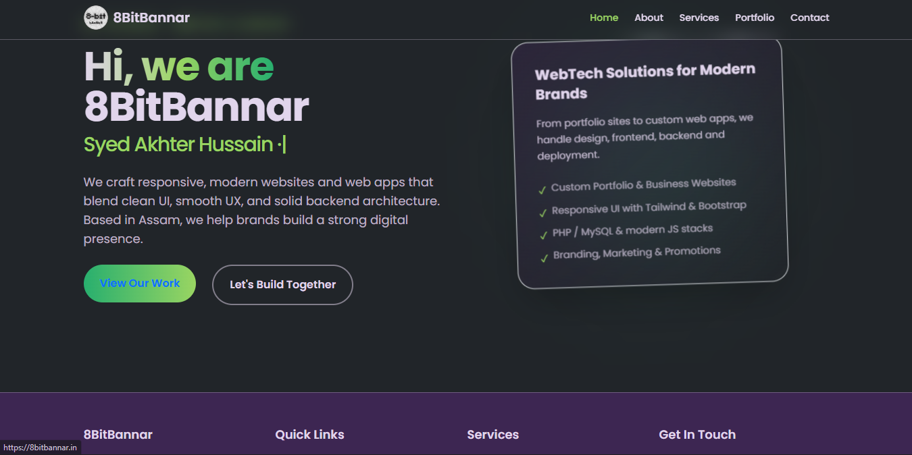
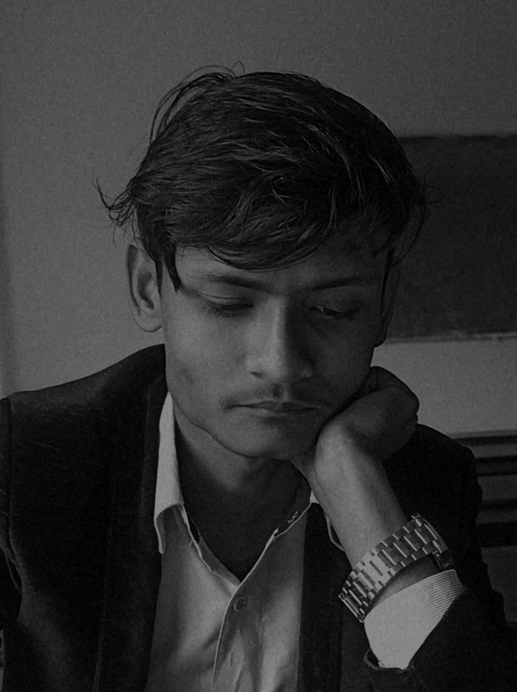

# 8BitBannar – WebTech Company Website

<!-- SEO Optimized GitHub README Header -->



<p align="center">
  <b>Modern WebTech Solutions · Portfolio Development · Full-Stack Web Development · UI/UX · Branding</b>
</p>

<p align="center">
  <a href="https://8bitbannar.in">🌐 Live Website</a> ·
  <a href="#-founders">👥 Founders</a> ·
  <a href="#-why-choose-8bitbannar">✨ Why Choose Us</a> ·
  <a href="#-mission--vision">🎯 Mission & Vision</a>
</p>

---

A modern, responsive, full‑stack‑ready website for **8BitBannar**, a WebTech & Digital Solutions company based in Assam. This platform showcases the company's services, portfolio, team, and brand identity through an elegant UI and smooth animations.

The website is built with **React + Vite**, optimized with **TailwindCSS**, **Bootstrap**, **Framer Motion**, and powered by **EmailJS** for seamless communication.

It is designed to be fully responsive, SEO‑optimized, fast-loading, visually appealing, and easy to scale for future features such as Admin Panels, Blogs, or Client Dashboards.

---

# 🖼️ Live Preview

### ▶️ **Visit Website:** [https://8bitbannar.in](https://8bitbannar.in)


---

# 🧩 Tech Stack Badges

### **Frontend & UI**


### **Animations**


### **Backend / API**


### **Deployment**


---

# 🚀 About the Project

8BitBannar is a WebTech startup founded by **Syed Akhter Hussain**. The company focuses on modern web solutions such as:

* Portfolio development
* Business and branding websites
* Web applications
* UI/UX design
* Marketing and digital promotions

---

# 📄 Pages & Sections

## 🏠 Home

Modern hero section with typed animation, framer-motion effects, and CTAs.

## 👥 About Us

Team overview featuring:

* Founder & Developers
* Skills
* Education

## 🛠 Services

We offer:

* Portfolio Development
* Web Development
* UI/UX & Branding

## 📁 Portfolio

Showcase of finished and practice projects.

## 📩 Contact

Fully working EmailJS-powered contact form with auto-reply.

---

# 🔧 Project Setup

### Install dependencies

```bash
npm install
```

### Run development server

```bash
npm run dev
```

### Create production build

```bash
npm run build
```

---

# 🌐 Deployment (Vercel)

To fix route refresh issues, add a `vercel.json` file:

```json
{
  "rewrites": [
    { "source": "/*", "destination": "/" }
  ]
}
```

---

# 👥 Founders


---

## 🧑‍💻 **Syed Akhter Hussain — Founder & Full Stack Developer**



**Role:** Full Stack Developer · Founder
**Skills:** React, PHP, MySQL, Tailwind, UI/UX, Deployment
**About:** Leads development, system design, and the overall technical vision of 8BitBannar.

---

## 🎨 **Nilotpal Choudhury — Co-Founder & Frontend Developer**


**Role:** Frontend Developer · Co-Founder
**Skills:** HTML, CSS, JavaScript, Responsive UI
**About:** Specializes in crafting smooth, clean, and modern user interfaces.

---

## 📢 **Rakibul Islam — Co-Founder & Marketing Lead**


**Role:** Marketing & Promotion · Co-Founder
**Skills:** Branding, Digital Marketing, Visibility Boost
**About:** Brings the 8BitBannar brand in front of the right audience through strategic promotion.

---

### **Syed Akhter Hussain** — Founder & Full Stack Developer

Lead developer, UI/UX architect, and technical head behind 8BitBannar.

### **Nilotpal Choudhury** — Co‑Founder & Frontend Developer

Specializes in UI layout, responsive design, and frontend integration.

### **Rakibul Islam** — Co‑Founder & Marketing Lead

Handles branding, visibility, digital promotion, and outreach.

---

# 👤 Author

**Syed Akhter Hussain** — Founder, 8BitBannar

📧 Email: [ah076145@gmail.com](mailto:ah076145@gmail.com)
📱 Phone: +91 9127222171
🌐 Website: [https://8bitbannar.in](https://8bitbannar.in)

---

# 🎯 Mission & Vision

### **Mission**

To empower individuals, students, freelancers, and businesses with modern digital solutions that combine clean UI, smooth UX, and strong backend systems — all while keeping affordability and quality at the core.

### **Vision**

To become one of the most trusted and creative WebTech brands in the Northeast, delivering impactful digital experiences and helping brands establish a powerful online presence.

---

# ⭐ Why Choose 8BitBannar?

* **Clean & Modern UI** – Beautiful interfaces built with Tailwind, Bootstrap, and custom design.
* **Performance Optimized** – Fast-loading pages with Vite, React, and optimized asset delivery.
* **Full-Stack Capabilities** – Frontend, backend, UI/UX, branding, deployment — everything in one place.
* **Affordable & Student-Friendly** – Perfect for students who need portfolios and individuals who need a quick online presence.
* **Highly Collaborative** – We shape your ideas into real digital products.

---

# 🏆 Founder Profiles


---

## 🧑‍💻 **Syed Akhter Hussain — Founder & Full Stack Developer**


**Role:** Full Stack Developer · Founder
**Skills:** React, PHP, MySQL, UI/UX, Tailwind, System Architecture
**About:** Leads technical development, architecture, deployment, and product direction at 8BitBannar.

---

## 🎨 **Nilotpal Choudhury — Co-Founder & Frontend Developer**


**Role:** Frontend Developer · Co-Founder
**Skills:** HTML, CSS, JavaScript, Responsive UI/UX
**About:** Specializes in clean interfaces and smooth user experiences.

---

## 📢 **Rakibul Islam — Co-Founder & Marketing Lead**


**Role:** Marketing & Promotion · Co-Founder
**Skills:** Digital Marketing, Social Media Strategy, Branding
**About:** Ensures brand visibility and audience engagement for 8BitBannar.

---

# 🏆 Founder Badges

### **Syed Akhter Hussain** — Founder & Full Stack Developer


---

### **Nilotpal Choudhury** — Co-Founder & Frontend Developer


---

### **Rakibul Islam** — Co-Founder & Marketing Lead


---

# 🔗 Founder Social Links

### **Syed Akhter Hussain**

*  [🌐 Website](https://8bitbannar.in)
*  [💼 LinkedIn](https://www.linkedin.com/in/syed-akhter-hussain-026361233/)
*  [📸 Instagram](https://instagram.com/syed_akhter_hussain)
*  [🐙 GitHub:](https://github.com/Ak7865)

### **Nilotpal Choudhury**

*  [💼 LinkedIn ](https://www.linkedin.com/in/nilotpal-choudhury-872317234/)
*  [📸 Instagram](https://www.instagram.com/nilotpal_8475)

### **Rakibul Islam**

*  [💼 LinkedIn](https://www.linkedin.com/in/rakibul-islam-809570239/)
*  [📸 Instagram](https://www.instagram.com/just_bul)

---

# ⭐ Contributions

Contributions, suggestions, and improvements are welcome!


